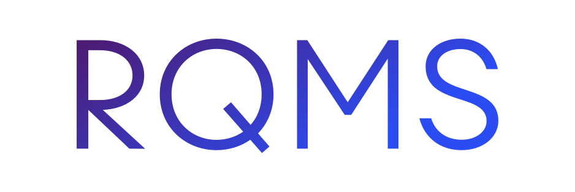

# Relevance Quality Management System (RQMS)

This Relevance Quality Management System is a prototype to show 
how a Domain-driven Design based architecture can be implemented.
The implementation is based upon a design used in my master thesis.
The thesis is currently not published, therefore no further information can be given.

## Description
A RQMS is an application which provides tools to improve the relevance of search results.
There are two main categories in which the RQMS supports:
1. **Offline:** 
   1. Assertion tests
   2. Judgment list tests (relevance cases)
2. **Online:**
   1. A/B Tests
   2. Timeseries based analysis
   3. Overview of zero result searches

## Contribution
This project does currently not accept contributions.
Please come back later, since we will likely accept contributions in the future.